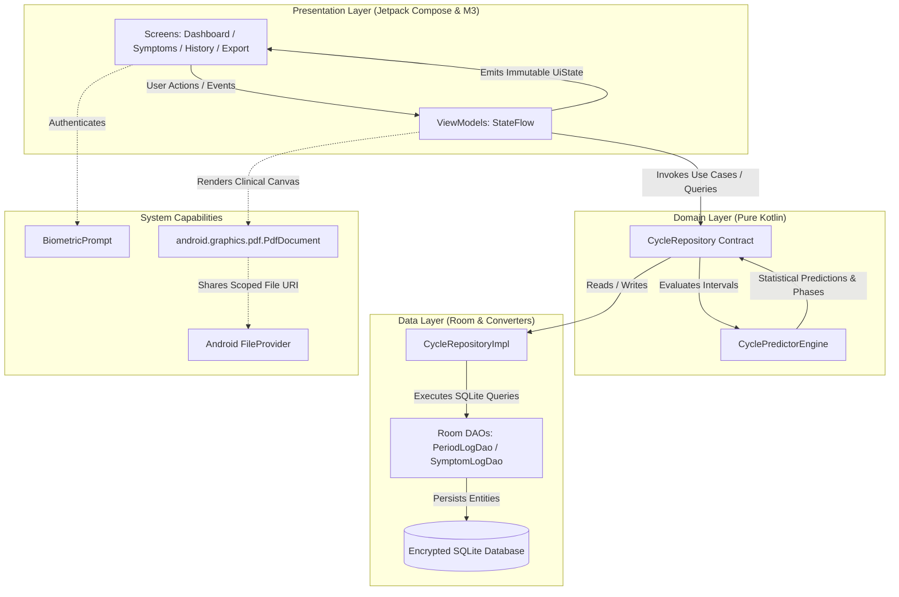

# Wellness Tracker 🌸

[](https://kotlinlang.org)
[](https://developer.android.com/jetpack/compose)
[](https://developer.android.com/about/versions/14)
[](https://developer.android.com/training/data-storage/room)
[](LICENSE)
[](#-privacy--threat-model)

A privacy-first, 100% on-device Android application engineered for menstrual cycle tracking, biomarker and symptom monitoring, fertility window estimation, and vector clinical PDF report generation — with dedicated architectural support for irregular cycles and postpartum recovery.

---

## 🌟 Core Tenets & Highlights

- **🛡️ 100% On-Device & Zero-Telemetry**: Complete sovereignty over personal reproductive data. The app deliberately omits `android.permission.INTERNET`, ensuring that zero bytes of health data ever leave the physical device.
- **📊 Adaptive Cycle Prediction Engine**: Replaces rigid 28-day assumptions with dynamic rolling percentiles (p25, median, p75) and dynamic Mean Absolute Error (MAE) confidence intervals.
- **👶 Postpartum Baseline Isolation**: Handles extended amenorrhea following childbirth through a one-tap baseline reset, preventing historical gaps (e.g., 200+ days) from skewing future predictions.
- **📈 Custom Hardware-Accelerated Canvas Charts**:
  - **BBT Trend Chart**: Smooth Bezier curve visualization of Basal Body Temperature with baseline threshold guides and ovulation correlation.
  - **Cycle Length Distribution**: Bar chart tracking historical cycle variations and deviations against rolling averages.
- **🌡️ Multi-Biomarker Daily Check-In**: Track BBT, LH ovulation surge tests, cervical mucus, flow levels, cramps/pain severity via interactive Material 3 sliders, and mood tags.
- **📄 Vector Clinical PDF Export**: Generates clean, doctor-ready multi-page clinical reports locally using Android's native vector Canvas, exportable via secure scoped `FileProvider`.
- **🔒 Local Biometric Authentication**: Hardware-backed biometric lock (fingerprint / face unlock) via AndroidX `BiometricPrompt` with device credential fallback.

---

## 🏗️ System Architecture

Wellness Tracker follows strict **Android Clean Architecture** and **Unidirectional Data Flow (UDF)** patterns:



### Module Structure

```
app/src/main/java/com/thewalkersoft/tracker/
├── TrackerApplication.kt               # Application entry point; initializes AppContainer
├── MainActivity.kt                     # Single-activity host; biometric authentication gate
│
├── data/                               # Data Layer
│   ├── local/
│   │   ├── AppDatabase.kt              # Room Database definition (v1)
│   │   ├── converter/DateConverters.kt # LocalDate <-> Epoch-day Room converters
│   │   ├── dao/
│   │   │   ├── PeriodLogDao.kt         # Observable Flow & CRUD for period cycles
│   │   │   └── SymptomLogDao.kt        # Observable Flow & CRUD for symptoms/biomarkers
│   │   └── entity/
│   │       ├── PeriodLogEntity.kt      # Period log table schema
│   │       └── SymptomLogEntity.kt     # Symptom log table schema
│   └── repository/
│       └── CycleRepositoryImpl.kt      # Bridges Room DAOs with CyclePredictorEngine
│
├── di/                                 # Dependency Injection Layer
│   └── AppContainer.kt                 # Lightweight, zero-reflection manual DI container
│
├── domain/                             # Domain Layer (Pure Kotlin / Math)
│   ├── model/
│   │   ├── CycleRecord.kt              # Historical cycle interval record
│   │   ├── CycleStatus.kt              # Enum: FOLLICULAR, OVULATION_WINDOW, LUTEAL, etc.
│   │   ├── PredictionResult.kt         # Computed target dates, percentiles, confidence
│   │   └── SymptomRecord.kt            # Aggregated symptom & biomarker record
│   ├── predictor/
│   │   └── CyclePredictorEngine.kt     # Statistical prediction & interval algorithm
│   └── repository/
│       └── CycleRepository.kt          # Domain repository interface
│
└── ui/                                 # Presentation Layer (Jetpack Compose & M3)
    ├── ViewModelFactory.kt             # AppViewModelProvider for ViewModel instantiation
    ├── dashboard/                      # Dashboard screen, cycle dial, phase insights
    ├── export/                         # Clinical PDF generation & FileProvider sharing
    ├── history/                        # Historical log list & CycleLengthChart
    ├── logging/                        # LogPeriodBottomSheet modal editor
    ├── navigation/                     # NavigationHost & Screen sealed routes
    ├── security/                       # BiometricAuthHelper & SecurityPreferences
    ├── symptoms/                       # Biomarker logging & BbtTrendChart
    └── theme/                          # Material 3 Color schemes, Typography, Shapes
```

---

## 🔬 Key Engineering Features

### 1. Adaptive Cycle Predictor Engine
Traditional period trackers assume a static 28-day cycle with ovulation locked to day 14. Wellness Tracker uses an adaptive statistical model designed for irregularity:
- **Breakthrough Bleeding Suppression**: Bleeding logged fewer than 14 days apart is classified as mid-cycle spotting and suppressed from baseline interval calculations.
- **Dynamic MAE Expansion**:
  $$\text{Earliest Likely Date} = \max(21, p25 - \lfloor MAE / 2 \rfloor)$$
  $$\text{Latest Likely Date} = p75 + \lfloor MAE / 2 \rfloor$$
- **Postpartum Reset**: Isolates pre-pregnancy or postpartum amenorrhea cycles so calculations immediately calibrate to resuming biological rhythms.

> 📖 **Read the full mathematical formulation and clinical justifications in [`docs/CYCLE_PREDICTION_ENGINE.md`](docs/CYCLE_PREDICTION_ENGINE.md)**.

### 2. Custom Canvas Visualizations
- **`BbtTrendChart`** (`ui/symptoms/components/BbtTrendChart.kt`):
  - Renders continuous Basal Body Temperature measurements using cubic Bezier curve paths.
  - Features gradient fills under the curve, dynamic vertical scaling based on the user's temperature range ($35.0^\circ\text{C}$ to $39.0^\circ\text{C}$), horizontal dashed baseline guides, and localized date labels.
- **`CycleLengthChart`** (`ui/history/components/CycleLengthChart.kt`):
  - Custom bar distribution comparing recent cycle durations against the user's historical rolling median.
  - Highlights standard variations and marks atypical deviations.

### 3. Doctor-Ready Clinical PDF Export
- **`DoctorPdfGenerator`** (`ui/export/DoctorPdfGenerator.kt`):
  - Builds native vector A4 PDF reports (`android.graphics.pdf.PdfDocument`) directly on the device.
  - Summarizes cycle regularity, average lengths, symptom frequencies, and BBT biphasic shifts.
  - Dispatches via Android's `FileProvider` so reports can be printed, saved to local storage, or handed directly to healthcare providers without internet exposure.

### 4. Biometric Security Gate
- **`BiometricAuthHelper`** (`ui/security/BiometricAuthHelper.kt`):
  - Enforces local fingerprint or face biometric verification on application launch.
  - Seamless fallback to device PIN, pattern, or password when biometrics are unavailable.
  - Biometric state toggled securely via `SecurityPreferences`.

---

## 🛡️ Privacy & Threat Model

| Threat / Risk Vector | App Architectural Defense |
| :--- | :--- |
| **Cloud Data Breaches & Subpoenas** | **Zero Cloud Storage**: All records reside solely in an unshared SQLite database in private app storage (`/data/data/com.thewalkersoft.tracker/databases/`). |
| **Network Interception / Leakage** | **Zero Internet Permission**: The app **does not declare** `android.permission.INTERNET`. Network sockets cannot be created at the OS level. |
| **Third-Party Data Brokers & Ad Trackers** | **Zero External SDKs**: No Google Analytics, Firebase, Crashlytics, Facebook SDK, or advertising networks are included. |
| **Device Theft / Unauthorized Physical Access** | **Biometric Gate**: Instant biometric authentication shield powered by AndroidX `BiometricPrompt`. |
| **Accidental File Exposure** | **Scoped FileProvider Sharing**: Exported PDFs are written to an internal app cache directory and shared strictly via temporary, restricted content URIs. |

---

## 🚀 Getting Started & Build Commands

### Prerequisites
- **JDK**: Java 11 or higher (configured in `JAVA_HOME`)
- **Android SDK**: Min SDK `34` (Android 14), Target SDK `36` (Android 16 baseline), Compile SDK `36`
- **Build System**: Gradle 9.2.1 / AGP 9.2.1 with Kotlin 2.2.10

### Command-Line Workflows

Run all tasks using the Gradle wrapper from the project root:

```bash
# Run all unit tests
./gradlew test

# Run cycle predictor domain tests specifically
./gradlew testDebugUnitTest --tests "com.thewalkersoft.tracker.domain.predictor.CyclePredictorEngineTest"

# Run dashboard presentation tests
./gradlew testDebugUnitTest --tests "com.thewalkersoft.tracker.ui.dashboard.DashboardViewModelTest"

# Trigger Kotlin Symbol Processing (KSP) code generation
./gradlew kspDebugKotlin

# Build Debug APK
./gradlew assembleDebug

# Install Debug APK to a connected device or running emulator
./gradlew installDebug

# Clean build directory and caches
./gradlew clean
```

---

## 🛠️ Tech Stack & Dependencies

| Category | Component | Version | Purpose |
| :--- | :--- | :--- | :--- |
| **Language** | Kotlin | `2.2.10` | Core programming language |
| **UI Toolkit** | Jetpack Compose | BOM `2025.02.00` | Declarative UI & Material 3 components |
| **Architecture** | Architecture Components | `2.8.7` | ViewModel, Lifecycle, Navigation Compose |
| **Persistence** | AndroidX Room | `2.6.1` | SQLite object mapping & observable Flow queries |
| **Code Generation** | Google KSP | `2.2.10-2.0.2` | High-performance Kotlin annotation processing |
| **Asynchronous** | Kotlinx Coroutines | `1.10.1` | Structured concurrency & reactive StateFlow |
| **Security** | AndroidX Biometric | `1.2.0-alpha05` | Fingerprint & facial authentication prompts |
| **Graphics / PDF** | Android Native Graphics | SDK `36` | Canvas, Paint, and Vector PDF generation |
| **Testing** | JUnit 4 & Coroutines Test | `4.13.2` / `1.10.1` | Unit testing & virtual time dispatchers |

---

## 📚 Project Documentation

- **[`AGENTS.md`](AGENTS.md)** — Operational manual, architecture boundaries, coding conventions, verification checklists, and developer playbooks.
- **[`docs/SRS.md`](docs/SRS.md)** — Formal IEEE 29148 / 830 Software Requirements Specification (functional & non-functional requirements).
- **[`docs/features/`](docs/features/README.md)** — Master Feature Catalog indexing all 5 business & clinical features.
- **[`docs/templates/`](docs/templates/)** — Canonical Android Clean Architecture feature documentation templates and authoring manual.
- **[`docs/CYCLE_PREDICTION_ENGINE.md`](docs/CYCLE_PREDICTION_ENGINE.md)** — Mathematical formulations, clinical references, interval calculations, and prediction states.
- **[`.agents/skills/`](.agents/skills/)** — Repository skills for ADB device debugging, Gradle build optimization, and Jetpack Compose best practices.

---

## 📄 License

This project is licensed under the **Apache License, Version 2.0** — see the [LICENSE](LICENSE) file for details.

```
Copyright 2026 The Walker Soft (Diwakar Kushwaha)

Licensed under the Apache License, Version 2.0 (the "License");
you may not use this file except in compliance with the License.
You may obtain a copy of the License at

    http://www.apache.org/licenses/LICENSE-2.0
```