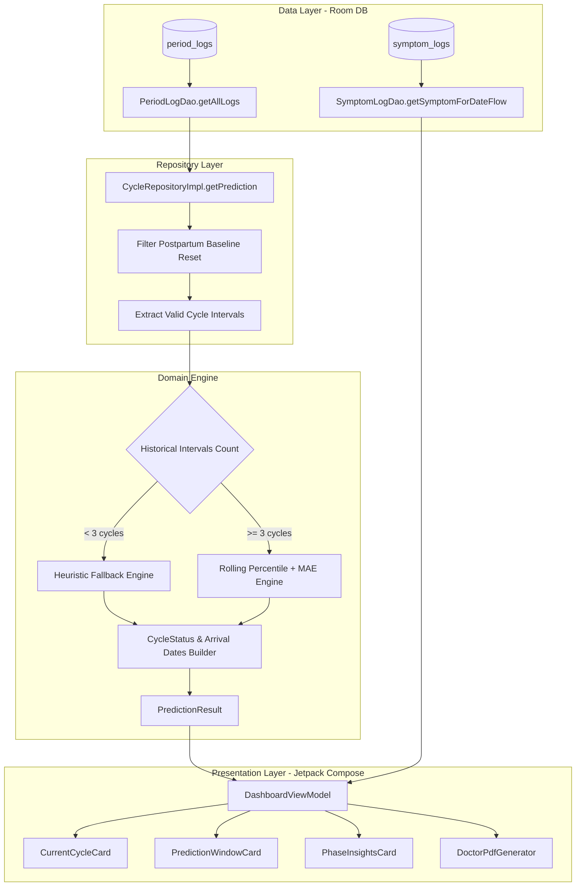
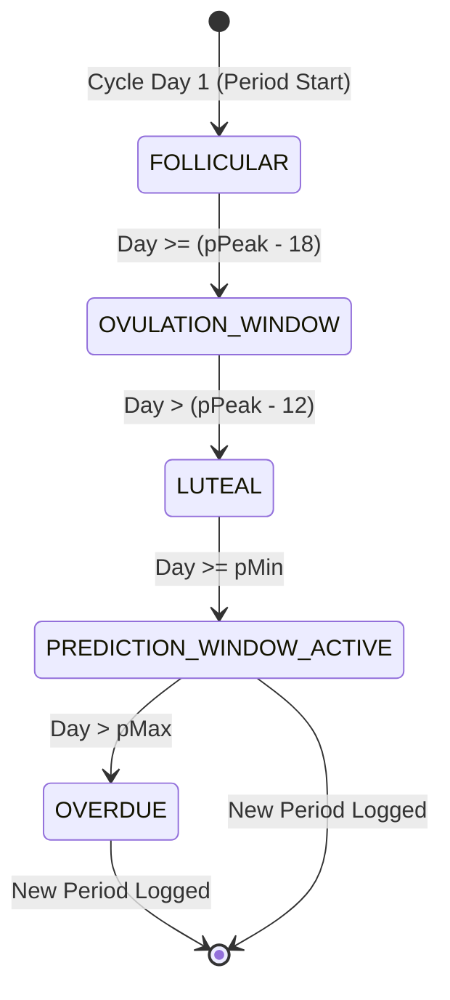

# Cycle Prediction Engine — Technical & Clinical Specification

**Wellness Tracker** (`com.thewalkersoft.tracker`) • Core Algorithm Specification  
*Document Version:* `1.0.0` • *Target SDK:* `36` (Android 14+) • *100% On-Device & Zero-Telemetry*

---

## 1. Executive Summary & Philosophy

The **Cycle Prediction Engine** ([`CyclePredictorEngine.kt`](file:///c:/DK_World/IT/MyProjects/wellness-tracker/app/src/main/java/com/thewalkersoft/tracker/domain/predictor/CyclePredictorEngine.kt)) is a deterministic, privacy-first, on-device statistical modeling engine designed for menstrual cycle tracking, fertile window estimation, and irregular/postpartum cycle adaptation.

### Core Non-Negotiables
1. **Zero Cloud Dependency & Zero Telemetry**: Prediction models run entirely on the local Android device CPU via pure Kotlin logic. No remote API calls, cloud neural networks, or user tracking telemetry are utilized.
2. **Clinical Utility for Irregular Cycles**: Rather than enforcing rigid 28-day assumptions, the engine dynamically models cycle variability using rolling percentiles with Mean Absolute Error (MAE) confidence window expansion.
3. **Postpartum Amenorrhea Isolation**: Provides a clean baseline reset mechanism to isolate postpartum recovery cycles from prior pre-pregnancy history.

---

## 2. End-to-End System Architecture

The following sequence illustrates the unidirectional data flow (UDF) from persistence to UI rendering:



---

## 3. Domain Model Contracts

### `PredictionResult`
Defined in [`PredictionResult.kt`](file:///c:/DK_World/IT/MyProjects/wellness-tracker/app/src/main/java/com/thewalkersoft/tracker/domain/model/PredictionResult.kt):

| Property | Type | Description |
| :--- | :--- | :--- |
| `lastPeriodDate` | `LocalDate` | Start date of the most recent recorded period cycle. |
| `currentCycleDay` | `Int` | Current cycle day ($1$-indexed, where Day 1 = start of menses). |
| `earliestLikelyDate` | `LocalDate` | Lower bound of predicted menstruation arrival. |
| `targetPeakDate` | `LocalDate` | Most probable menstruation arrival date (median peak). |
| `latestLikelyDate` | `LocalDate` | Upper bound of predicted arrival (before transitioning to Overdue). |
| `confidenceWindowDays`| `Int` | Duration in days between `latestLikelyDate` and `earliestLikelyDate`. |
| `status` | `CycleStatus` | Active physiological phase or prediction state. |
| `meanAbsoluteError` | `Int` | Dynamic MAE error buffer (in days) calculated from recent cycles. |
| `recentCycleCount` | `Int` | Number of recent historical cycles used in the statistical model. |

---

### `CycleStatus`
Defined in [`CycleStatus.kt`](file:///c:/DK_World/IT/MyProjects/wellness-tracker/app/src/main/java/com/thewalkersoft/tracker/domain/model/CycleStatus.kt):



---

## 4. Mathematical & Statistical Formulations

### 1. Cycle Day Indexing
In clinical gynecology, cycle day numbering is $1$-indexed, starting on the first day of menstrual flow:

$$\text{currentCycleDay} = \text{DAYS.between}(\text{lastPeriodDate}, \text{today}) + 1$$

*Example*: If `lastPeriodDate` is `2026-06-01` and `today` is `2026-06-01`, $\text{currentCycleDay} = 0 + 1 = 1$.

---

### 2. Heuristic Fallback Mode ($N < 3$ Cycles)
When fewer than 3 historical cycle intervals are available, the engine avoids premature statistical extrapolation and adopts a conservative wide-window heuristic designed for irregular/postpartum tracking baselines:

$$\begin{aligned}
p_{\min} &= 30\text{ days} \\
p_{\text{peak}} &= 35\text{ days} \\
p_{\max} &= 40\text{ days} \\
\text{MAE} &= 2\text{ days}
\end{aligned}$$

---

### 3. Rolling Percentiles with Dynamic MAE Expansion ($N \ge 3$ Cycles)
When 3 or more completed cycle intervals exist, the engine analyzes up to the **last 6 cycles** ($N \le 6$) sorted in ascending order:

$$\text{recentCycles} = [c_1, c_2, \dots, c_N], \quad c_1 \le c_2 \le \dots \le c_N$$

#### A. Percentile Computation
- **Lower Quartile ($25\text{th}$ Percentile)**:
  $$p_{25} = \text{recentCycles}[\lfloor N \times 0.25 \rfloor]$$
- **Median ($50\text{th}$ Percentile / Target Peak)**:
  $$p_{\text{peak}} = \text{recentCycles}[\lfloor N / 2 \rfloor]$$
- **Upper Quartile ($75\text{th}$ Percentile)**:
  $$p_{75} = \text{recentCycles}\left[\min\left(\lfloor N \times 0.75 \rfloor, N - 1\right)\right]$$

#### B. Mean Absolute Error (MAE)
To quantify cycle irregularity and variance around the median:

$$\text{MAE} = \max\left(1, \left\lfloor \frac{1}{N} \sum_{i=1}^{N} |c_i - p_{\text{peak}}| \right\rfloor\right)$$

#### C. Dynamic Window Expansion & Physiological Safety Clamp
The confidence window dynamically expands using half the computed MAE, and the lower bound is clamped to the biological minimum threshold of normal cycles ($21\text{ days}$):

$$\begin{aligned}
p_{\min} &= \max\left(21, p_{25} - \left\lfloor \frac{\text{MAE}}{2} \right\rfloor\right) \\
p_{\max} &= p_{75} + \left\lfloor \frac{\text{MAE}}{2} \right\rfloor
\end{aligned}$$

#### D. Predicted Calendar Dates
$$\begin{aligned}
\text{earliestLikelyDate} &= \text{lastPeriodDate} + p_{\min}\text{ days} \\
\text{targetPeakDate} &= \text{lastPeriodDate} + p_{\text{peak}}\text{ days} \\
\text{latestLikelyDate} &= \text{lastPeriodDate} + p_{\max}\text{ days}
\end{aligned}$$

---

## 5. Physiological Phases & Clinical Justification

The engine translates the current cycle day into one of five distinct physiological phases:

```
Cycle Day: 1 ............. (pPeak-18) ........ (pPeak-12) ........ pMin .............. pMax ........... >pMax
Phase:     |--- FOLLICULAR ---|-- FERTILE/OV --|--- LUTEAL ---|-- DUE SOON (ACTIVE) --|--- OVERDUE ---|
```

### Phase Evaluation Logic

```kotlin
val status = when {
    currentDay > pMax -> CycleStatus.OVERDUE
    currentDay >= pMin -> CycleStatus.PREDICTION_WINDOW_ACTIVE
    currentDay in (pPeak - 18)..(pPeak - 12) -> CycleStatus.OVULATION_WINDOW
    currentDay > (pPeak - 12) -> CycleStatus.LUTEAL
    else -> CycleStatus.FOLLICULAR
}
```

### Clinical Rationale

1. **Ovulation & Fertile Window ($[p_{\text{peak}} - 18, p_{\text{peak}} - 12]$)**:
   - In standard human reproductive physiology, the **luteal phase** remains relatively constant at approximately $14 \text{ days}$ ($\pm 2\text{ days}$).
   - Therefore, ovulation is estimated to occur at $p_{\text{peak}} - 14\text{ days}$.
   - Accounting for **sperm viability in cervical mucus (up to 5 days)** and **oocyte viability (12–24 hours)**, the clinically fertile window spans a 6-day period:
     $$\text{Fertile Window} = [p_{\text{peak}} - 18, p_{\text{peak}} - 12]$$
2. **Luteal Phase ($>(p_{\text{peak}} - 12)$ until $p_{\min}$)**:
   - Progesterone secretion dominates; basal body temperature shifts upward.
3. **Prediction Window Active ($[p_{\min}, p_{\max}]$)**:
   - The user has entered the dynamic statistical probability zone for menses arrival.
4. **Overdue ($>p_{\max}$)**:
   - Menstruation has not arrived past the dynamic upper confidence limit, indicating cycle delay, stress, travel, or possible pregnancy.

---

## 6. Postpartum Baseline Reset

### Clinical Problem
Following childbirth and during lactation, individuals often experience prolonged postpartum amenorrhea ranging from 60 to 300+ days. Including this single extreme interval in rolling averages would distort future cycle predictions for months.

### Solution & Mechanics
When a user records a period with `isPostpartumBaselineReset = true`:

```kotlin
fun isolatePostpartumRecords(records: List<CycleRecord>): List<CycleRecord> {
    val sorted = records.sortedBy { it.startDate }
    val latestResetIndex = sorted.indexOfLast { it.isPostpartumBaselineReset }
    return if (latestResetIndex != -1) {
        sorted.subList(latestResetIndex, sorted.size)
    } else {
        sorted
    }
}
```

All logs preceding the reset date are cleanly excluded from prediction modeling, establishing an untainted postpartum baseline.

---

## 7. Interval Extraction & Spotting Suppression

### Current Behavior
In [`CyclePredictorEngine.computeCycleIntervals`](file:///c:/DK_World/IT/MyProjects/wellness-tracker/app/src/main/java/com/thewalkersoft/tracker/domain/predictor/CyclePredictorEngine.kt#L30-L35):
```kotlin
fun computeCycleIntervals(sortedStartDates: List<LocalDate>): List<Int> {
    if (sortedStartDates.size < 2) return emptyList()
    return sortedStartDates.zipWithNext { current, next ->
        ChronoUnit.DAYS.between(current, next).toInt()
    }.filter { it >= 14 }
}
```

### Analysis & Nuance
`zipWithNext` pairs adjacent entries $[d_0 \to d_1, d_1 \to d_2, \dots]$.
- If a user logs a mid-cycle spotting event on Day 6 (e.g., `Jan 1 (Period)`, `Jan 6 (Spotting)`, `Jan 29 (Next Period)`):
  - $Jan 1 \to Jan 6 = 5\text{ days}$ (filtered out).
  - $Jan 6 \to Jan 29 = 23\text{ days}$ (retained).
- *Observation*: The true interval is $28\text{ days}$ ($Jan 1 \to Jan 29$). To prevent spotting from anchoring the next interval, intermediate entries $< 14\text{ days}$ should ideally be filtered from `sortedStartDates` *prior* to pairing.

---

## 8. Verification & Test Suite Matrix

The prediction engine is validated by automated unit tests in [`CyclePredictorEngineTest.kt`](file:///c:/DK_World/IT/MyProjects/wellness-tracker/app/src/test/java/com/thewalkersoft/tracker/domain/predictor/CyclePredictorEngineTest.kt):

| Test Case | Input Parameters | Expected Outcome | Clinical / Mathematical Verification |
| :--- | :--- | :--- | :--- |
| **Spotting Filter** | Dates with 5-day spotting interval | Intervals $< 14\text{d}$ filtered | Breakthrough bleeding discarded. |
| **Sparse Fallback** | 2 cycle intervals (`[30, 32]`) | `pMin=30, pPeak=35, pMax=40, MAE=2` | Prevents over-fitting on $<3$ cycles. |
| **Fluctuating Cycles** | Irregular intervals: `[30, 32, 36, 40, 34]` | `pPeak=34, pMin=31, pMax=37, MAE=2` | Median = 34; IQR + MAE expansion verified. |
| **Overdue Transition**| Cycle day 36 vs. `pMax = 28` | Status = `CycleStatus.OVERDUE` | Correct state boundary enforcement. |
| **Fertile Phase** | Day 14 of 28-day baseline | Status = `CycleStatus.OVULATION_WINDOW` | Day $14 \in [10, 16]$ fertile window. |
| **Postpartum Reset** | Historical records with reset flag | Slices at latest reset index | Ignores pre-reset amenorrhea. |

---

## 9. Future Algorithm Roadmap

1. **Biphasic BBT Shift Integration**: Incorporate daily Basal Body Temperature ($0.2^\circ\text{C} - 0.5^\circ\text{C}$ thermal shift over 3 consecutive days) to retroactively confirm ovulation day.
2. **LH Surge Alignment**: Leverage positive/peak LH test strips to calibrate the luteal phase length on an individual user basis (e.g. 12 days vs. 14 days).
3. **Sequential Spotting Pruning**: Enhance `computeCycleIntervals` with pre-filtering of non-baseline dates.
