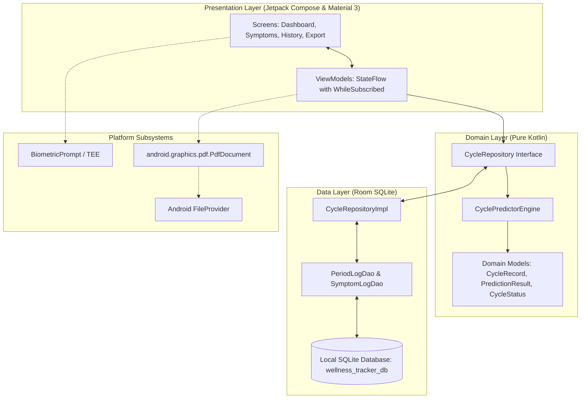

# Software Requirements Specification (SRS)
## Wellness Tracker — Privacy-First Menstrual & Biomarker Health System

**Document Identifier**: `SRS-WT-2026-V1.0`  
**Standard**: Adapted from **IEEE 29148 / 830** Standard for Software Requirements Specifications  
**Application Package**: `com.thewalkersoft.tracker`  
**Target Platform**: Android 14+ (Min SDK: 34, Target SDK: 36)  
**Security Baseline**: 100% On-Device / Zero-Telemetry Architecture  

---

## Table of Contents
1. [Introduction](#1-introduction)
   - 1.1 Purpose
   - 1.2 Scope of the Software
   - 1.3 Definitions, Acronyms, and Abbreviations
   - 1.4 Core Architectural Philosophy & Non-Negotiables
   - 1.5 Document References
2. [Overall Description](#2-overall-description)
   - 2.1 Product Perspective & Clean Architecture Model
   - 2.2 Product Functions Overview
   - 2.3 User Classes and Personas
   - 2.4 Operating Environment
   - 2.5 Design and Implementation Constraints
   - 2.6 Assumptions and Dependencies
3. [Specific System Requirements](#3-specific-system-requirements)
   - 3.1 Functional Requirements (REQ-F-01 through REQ-F-08)
   - 3.2 External Interface Requirements
   - 3.3 Non-Functional Requirements (NFRs)
4. [Verification & Traceability Matrix](#4-verification--traceability-matrix)

---

## 1. Introduction

### 1.1 Purpose
This Software Requirements Specification (SRS) establishes the formal functional and non-functional engineering requirements for **Wellness Tracker** (`com.thewalkersoft.tracker`). It serves as the authoritative baseline for software engineers, QA verification suites, clinical review, and AI coding agents working in this repository.

### 1.2 Scope of the Software
Wellness Tracker is an on-device Android application engineered for:
- Menstrual cycle tracking and interval calculation.
- Adaptive cycle arrival forecasting using dynamic rolling percentiles and Mean Absolute Error (MAE) confidence window expansion.
- Postpartum amenorrhea isolation and mid-cycle spotting suppression.
- Daily multi-biomarker logging (Basal Body Temperature, LH ovulation tests, cramps severity, mood).
- Vector cubic Bezier curve visualization for Basal Body Temperature shifts.
- Historical cycle distribution bar chart analytics.
- On-device vector A4 clinical PDF report generation for medical consultations.
- Hardware-backed biometric authentication gating via AndroidX `BiometricPrompt`.

### 1.3 Definitions, Acronyms, and Abbreviations
| Term / Acronym | Definition |
| :--- | :--- |
| **BBT** | **Basal Body Temperature**: The lowest resting body temperature, typically recorded immediately upon waking. |
| **LH** | **Luteinizing Hormone**: Hormone whose surge triggers ovulation within 24–36 hours. |
| **MAE** | **Mean Absolute Error**: $\frac{1}{N}\sum |x_i - \text{median}|$, used to expand confidence windows dynamically. |
| **Postpartum Amenorrhea** | Absence of menstruation following childbirth, often lasting months due to lactation hormones. |
| **PCOS** | **Polycystic Ovary Syndrome**: Endocrine condition causing irregular, prolonged, or absent cycles. |
| **UDF** | **Unidirectional Data Flow**: Architecture pattern where state flows down and events flow up. |
| **DAO** | **Data Access Object**: Room persistence interface defining SQLite queries and Flow streams. |
| **TEE** | **Trusted Execution Environment**: Hardware-isolated processor environment executing biometric matches. |
| **Zero-Telemetry** | Architectural guarantee that zero analytics, crash reports, or personal health records leave the device. |

### 1.4 Core Architectural Philosophy & Non-Negotiables
1. **Zero-Telemetry & 100% On-Device**: The application **omits `android.permission.INTERNET`** from `AndroidManifest.xml`. No network requests, cloud sync backends, or third-party tracking SDKs can ever be introduced.
2. **Clinical Utility**: Visualizations and PDF exports must represent medically sound physiological patterns (e.g. biphasic thermal shifts).
3. **Adaptive Prediction**: The system adapts mathematically to user biological variation rather than enforcing rigid 28-day assumptions.
4. **Local Biometric Security**: Health records are physically gated behind the device's hardware-backed biometric authentication.

### 1.5 Document References
- IEEE Std 29148-2018: Systems and software engineering — Life cycle processes — Requirements engineering.
- Android Jetpack Architecture Guide (`androidx.compose`, `androidx.room`, `androidx.lifecycle`).
- Wellness Tracker Algorithmic Specification: [`docs/CYCLE_PREDICTION_ENGINE.md`](CYCLE_PREDICTION_ENGINE.md).
- Wellness Tracker Developer Operating Manual: [`AGENTS.md`](../AGENTS.md).
- Master Feature Catalog: [`docs/features/README.md`](features/README.md).

---

## 2. Overall Description

### 2.1 Product Perspective & Clean Architecture Model
Wellness Tracker is an autonomous, standalone mobile health application operating entirely on the host Android device. It follows Android Clean Architecture with Unidirectional Data Flow (UDF):

### 2.2 Product Functions Overview
- **Predictive Forecasting**: Dynamically forecasts upcoming cycle start dates, fertility windows, and current cycle phases.
- **Biomarker Recording**: Captures daily BBT readings, LH test results, cramp intensity (1-5), and emotional mood tags.
- **Visual Analytics**: Renders continuous smoothed Bezier curves for BBT and historical bar charts for cycle durations.
- **Clinical Reporting**: Assembles doctor-ready A4 vector PDF documents and shares them locally via Android `FileProvider`.
- **Privacy Gating**: Protects health data with fingerprint, face unlock, or device PIN.

### 2.3 User Classes and Personas
1. **Regular Tracker**: Wants accurate cycle alerts without privacy concerns or advertising clutter.
2. **Postpartum Mother**: Returning to cycle tracking after months of amenorrhea; needs previous extended gaps excluded from current predictions.
3. **Irregular Cycle / PCOS Tracker**: Experiences fluctuating cycle lengths (e.g. 25–50 days); requires adaptive confidence windows rather than fixed 28-day predictions.
4. **Clinical Provider (Doctor/OB-GYN)**: Reads the exported vector PDF report during in-office medical consultations.

### 2.4 Operating Environment
- **Operating System**: Android 14 (API Level 34) through Android 16 (API Level 36).
- **Runtime Virtual Machine**: Android Runtime (ART), Target JVM 11.
- **Local Persistence**: SQLite via AndroidX Room 2.6.1.
- **Display Requirements**: Density-independent scalable UI (Jetpack Compose Material 3), compatible with 320dp to 1000dp widths.
- **Hardware Integration**: Hardware biometric sensor (Fingerprint / Face Unlock via `BiometricManager.Authenticators.BIOMETRIC_STRONG`).

### 2.5 Design and Implementation Constraints
- **Zero Network Sockets**: The application must never open HTTP/HTTPS connections. Network capability is blocked at the operating system manifest level.
- **Zero Third-Party Telemetry**: Prohibits Google Analytics, Firebase, Crashlytics, Mixpanel, or advertising SDKs.
- **Main Thread Isolation**: All Room SQLite transactions, PDF generation, and statistical predictions must be dispatched on `Dispatchers.IO` or `Dispatchers.Default`.
- **Canvas Rendering Hygiene**: Drawing routines (`Canvas`, `DrawScope`) must never allocate memory or create objects (`Paint`, `Path`, `PathEffect`) inside the `onDraw` frame loop.

### 2.6 Assumptions and Dependencies
- The device OS provides a functional SQLite runtime and internal app-scoped storage (`/data/data/com.thewalkersoft.tracker/`).
- Users enter dates in chronological sequence; breakthrough spotting is handled algorithmically.

---

## 3. Specific System Requirements

### 3.1 Functional Requirements

#### `REQ-F-01`: Menstrual Period Logging & Interval Calculation
- **Description**: The system shall allow users to record menstrual period start dates, end dates, flow intensity, and personal notes.
- **Inputs**: `startDate: LocalDate`, `endDate: LocalDate?`, `flowIntensity: String?`, `notes: String?`, `isPostpartumReset: Boolean`.
- **Processing**:
  1. Validates that `endDate` (if present) is $\ge \text{startDate}$.
  2. Inserts or updates the record in SQLite table `period_logs`.
  3. Sorts all records chronologically and computes cycle intervals between adjacent period start dates:
     $$\text{duration}_i = \text{ChronoUnit.DAYS.between}(\text{startDate}_i, \text{startDate}_{i+1})$$
- **Outputs**: Emits updated `List<CycleRecord>` via reactive `Flow`.

#### `REQ-F-02`: Adaptive Cycle Prediction & Dynamic MAE Expansion
- **Description**: The system shall compute upcoming cycle arrival targets, confidence ranges, and current biological status.
- **Processing**:
  1. When $< 3$ cycle intervals exist, apply heuristic fallback: Earliest = Day 30, Target = Day 35, Latest = Day 40.
  2. When $\ge 3$ cycle intervals exist, evaluate the last 6 completed intervals:
     - Target Date = Median interval ($\text{p50}$).
     - Lower Bound ($\text{p25}$) = 25th percentile.
     - Upper Bound ($\text{p75}$) = 75th percentile.
     - Mean Absolute Error ($\text{MAE}$) = $\frac{1}{N}\sum |cycle_i - median|$.
     - Earliest Likely Day = $\max(21, p25 - \lfloor MAE / 2 \rfloor)$.
     - Latest Likely Day = $p75 + \lfloor MAE / 2 \rfloor$.
  3. Evaluates current cycle day and assigns `CycleStatus`:
     - `FOLLICULAR`: Days 1 through $\text{targetDay} - 19$.
     - `OVULATION_WINDOW`: Days $[\text{targetDay} - 18, \text{targetDay} - 12]$.
     - `LUTEAL`: Days between Ovulation window end and prediction window start.
     - `PREDICTION_WINDOW_ACTIVE`: $\text{currentDay} \in [\text{earliestDay}, \text{latestDay}]$.
     - `OVERDUE`: $\text{currentDay} > \text{latestDay}$.
- **Outputs**: Emits `PredictionResult` with target dates, confidence scores, and `CycleStatus`.

#### `REQ-F-03`: Breakthrough Bleeding Noise Suppression & Postpartum Reset
- **Description**: The system shall filter anomalies and postpartum amenorrhea from skewing statistical models.
- **Processing**:
  1. **Spotting Suppression**: Periods logged $< 14$ days apart are classified as breakthrough spotting and excluded from interval baselines.
  2. **Postpartum Reset**: When a period is marked `isPostpartumBaselineReset = true`, all historical logs prior to that date are discarded from future cycle length calculations.
- **Outputs**: Isolated, clean interval dataset for `CyclePredictorEngine`.

#### `REQ-F-04`: Multi-Biomarker Symptom Logging
- **Description**: The system shall allow users to log daily biomarkers independently or in conjunction with period dates.
- **Inputs**: `logDate: LocalDate`, `basalBodyTemp: Float?` (range 35.0 to 39.0°C), `crampsSeverity: Int?` (1 to 5), `mood: String?`, `ovulationTestResult: String?` (`NEGATIVE`, `POSITIVE`, `PEAK`).
- **Processing**: Saves record in SQLite table `symptom_logs` with `OnConflictStrategy.REPLACE` on date index.
- **Outputs**: Emits reactive `Flow<List<SymptomLogEntity>>`.

#### `REQ-F-05`: Basal Body Temperature Bezier Curve Visualization
- **Description**: The system shall render a hardware-accelerated, smoothed cubic Bezier curve of recent BBT readings.
- **Processing**:
  1. Filters the last 10 entries where `basalBodyTemp != null`.
  2. Normalizes temperatures against dynamic min/max bounds.
  3. Interpolates adjacent points using cubic splines (`cubicTo`) with horizontal control points.
  4. Renders a vertical gradient fill underneath the curve and dashed baseline indicators.
- **Outputs**: Vector Compose `Canvas` drawing without frame drops.

#### `REQ-F-06`: Historical Cycle Analytics & Bar Distribution
- **Description**: The system shall visualize completed cycle durations against historical averages.
- **Processing**:
  1. Extracts completed cycles ($\ge 2$ entries required).
  2. Calculates historical rolling average length.
  3. Renders vertical rounded bars representing cycle lengths up to the last 8 cycles.
  4. Renders horizontal reference line at average cycle length.
- **Outputs**: Vector Compose `Canvas` bar chart.

#### `REQ-F-07`: Doctor-Ready Vector Clinical PDF Report Generation
- **Description**: The system shall compile and render multi-page vector clinical reports in standard A4 PDF format.
- **Processing**:
  1. Instantiates `android.graphics.pdf.PdfDocument`.
  2. Measures and draws page elements on vector Canvas: A4 page bounds ($595 \times 842$ pt), margins (40 pt), typography, patient metadata, cycle regularity table, and symptom frequencies.
  3. Writes document to `context.cacheDir/reports/`.
  4. Generates secure `content://` URI via Android `FileProvider`.
- **Outputs**: PDF file on internal storage; launchable `Intent.ACTION_SEND` and `Intent.ACTION_VIEW` intents.

#### `REQ-F-08`: Hardware-Backed Biometric Security Gate
- **Description**: The system shall gate application access behind hardware biometric authentication when enabled.
- **Processing**:
  1. Reads `SecurityPreferences.isBiometricEnabled()`.
  2. If enabled, displays `androidx.biometric.BiometricPrompt` supporting `BIOMETRIC_STRONG` and `DEVICE_CREDENTIAL`.
  3. On success, unlocks Compose UI. On cancellation or failure, retains gated screen.
  4. Provides toggle in top application bar.
- **Outputs**: Gated or unlocked application state.

---

### 3.2 External Interface Requirements

#### 3.2.1 User Interfaces
- **Toolkit**: Jetpack Compose (BOM `2025.02.00`).
- **Design System**: Material Design 3 (`androidx.compose.material3`).
- **Theming**: Dynamic dark and light themes with semantic cycle phase palettes (Rose / Wellness theme).
- **Navigation**: Single-activity host (`MainActivity`) with Navigation Compose bottom navigation bar (`Dashboard`, `History`, `Symptoms`, `Export`).

#### 3.2.2 Hardware Interfaces
- **Biometric Hardware**: Interacts with device fingerprint readers and facial recognition sensors via Android's Trusted Execution Environment (TEE).
- **Display**: Minimum resolution 320x640 dp; adaptive to portrait and split-screen orientations.

#### 3.2.3 Software Interfaces
- **Database**: Local SQLite 3 via AndroidX Room `2.6.1` with KSP compiler.
- **File System**: Internal app-scoped sandbox storage; scoped file sharing via AndroidX `FileProvider`.
- **Graphics Subsystem**: Android Native 2D Graphics Canvas (`android.graphics.Canvas`, `android.graphics.pdf.PdfDocument`).

#### 3.2.4 Communications Interfaces
- **Network Capability**: **STRICTLY PROHIBITED**. The application declares no network permissions, contains no HTTP/REST clients, and opens no network sockets.

---

### 3.3 Non-Functional Requirements (NFRs)

#### 3.3.1 Privacy & Zero-Telemetry Non-Negotiables
- `NFR-PRI-01`: The application manifest shall **never** declare `android.permission.INTERNET`.
- `NFR-PRI-02`: No personal health identifiers (dates, symptoms, temperatures, notes) shall be written to production Logcat.
- `NFR-PRI-03`: Exported PDF reports shall never be written to public unmanaged external shared storage.

#### 3.3.2 Security & Data Isolation
- `NFR-SEC-01`: SQLite database files shall reside strictly in private application storage (`/data/data/com.thewalkersoft.tracker/databases/`).
- `NFR-SEC-02`: PDF document sharing must enforce temporary read-only permissions via `FLAG_GRANT_READ_URI_PERMISSION`.
- `NFR-SEC-03`: Biometric verification must rely on hardware-backed keys and OS prompts; no biometric credentials shall be stored by the app.

#### 3.3.3 Performance & Frame Budget
- `NFR-PERF-01`: UI rendering must maintain a consistent 60 frames per second (16.6ms frame budget).
- `NFR-PERF-02`: Custom Canvas charting (`BbtTrendChart`, `CycleLengthChart`) must allocate zero objects (`Paint`, `Path`, `PathEffect`) within the `DrawScope` onDraw pass.
- `NFR-PERF-03`: PDF generation must execute asynchronously on `Dispatchers.IO` and complete within 1.5 seconds for up to 100 historical cycles.

#### 3.3.4 Concurrency & Dispatcher Threading
- `NFR-THRD-01`: Main thread (`Dispatchers.Main`) must never execute Room queries or mathematical prediction loops.
- `NFR-THRD-02`: ViewModels must manage state using `SharingStarted.WhileSubscribed(5000)` to prevent background Flow processing when the UI is stopped.

#### 3.3.5 Reliability & Schema Evolution
- `NFR-REL-01`: Room schema changes must be accompanied by explicit database migration scripts; destructive database wipes in production are prohibited.
- `NFR-REL-02`: The application must withstand process termination by the Android OS in low-memory states and restore state from Room upon recreation.

#### 3.3.6 Memory, Storage & Battery Hygiene
- `NFR-RES-01`: Baseline application APK size shall not exceed 15 megabytes.
- `NFR-RES-02`: Generated PDF reports in `context.cacheDir/reports/` must be cleanable by standard Android OS cache scavenging.

---

## 4. Verification & Traceability Matrix

| Requirement ID | Requirement Description | Implementation Class / Component | Room DAO / Persistence | Verification Test Suite |
| :--- | :--- | :--- | :--- | :--- |
| **`REQ-F-01`** | Period Logging & Intervals | `CycleRecord`, `CycleRepositoryImpl` | `PeriodLogDao`, `PeriodLogEntity` | `CyclePredictorEngineTest.kt` |
| **`REQ-F-02`** | Adaptive Prediction & Dynamic MAE | `CyclePredictorEngine` | `CycleRepositoryImpl` | `CyclePredictorEngineTest.kt` |
| **`REQ-F-03`** | Spotting Suppression & Postpartum Reset | `CyclePredictorEngine` | `PeriodLogDao` | `CyclePredictorEngineTest.kt` |
| **`REQ-F-04`** | Multi-Biomarker Symptom Logging | `SymptomsViewModel`, `LogPeriodBottomSheet` | `SymptomLogDao`, `SymptomLogEntity` | `./gradlew test` |
| **`REQ-F-05`** | BBT Bezier Curve Visualization | `BbtTrendChart.kt` | `SymptomLogDao` | `@Preview BbtTrendChartPreview` |
| **`REQ-F-06`** | History Analytics & Bar Chart | `HistoryViewModel`, `CycleLengthChart` | `PeriodLogDao` | `@Preview CycleLengthChartPreview` |
| **`REQ-F-07`** | Clinical PDF Export | `DoctorPdfGenerator`, `ExportViewModel` | `FileProvider`, `file_paths.xml` | `./gradlew test`, Manual verification |
| **`REQ-F-08`** | Hardware Biometric Security Gate | `BiometricAuthHelper`, `MainActivity` | `SecurityPreferences` | `adb emu finger touch 1` |
| **`NFR-PRI-01`**| Zero-Telemetry / No Internet | `AndroidManifest.xml` | Local Sandbox Storage | Manifest lint check (`./gradlew assembleDebug`) |
| **`NFR-PERF-02`**| Canvas Zero Allocations | `BbtTrendChart`, `CycleLengthChart` | In-memory Compose state | `.agents/skills/jetpack-compose-best-practices` |
| **`NFR-THRD-02`**| StateFlow 5s Subscription | `DashboardViewModel`, `HistoryViewModel` | Reactive Flow streams | `DashboardViewModelTest.kt` |
