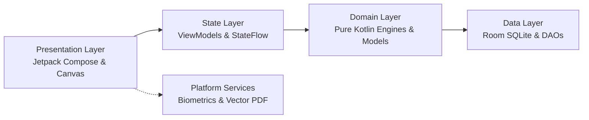

# Master Feature Catalog 🌸

This catalog indexes all business and clinical capabilities implemented in **Wellness Tracker** (`com.thewalkersoft.tracker`). Every feature adheres strictly to **Android Clean Architecture**, **Unidirectional Data Flow (UDF)**, and our non-negotiable **100% On-Device & Zero-Telemetry** privacy model.

---

## 📑 Feature Index

| Feature Capability | Status | Primary Entry Points | Documentation Suite |
| :--- | :--- | :--- | :--- |
| **1. Adaptive Cycle Prediction & Forecasting** | `COMPLETED` | `Screen.Dashboard`, `CurrentCycleCard`, `PredictionWindowCard` | [Specification](adaptive-cycle-prediction/README.md) \| [Code Map](adaptive-cycle-prediction/code-touch-map.md) \| [Data Flow](adaptive-cycle-prediction/data-flow.md) |
| **2. Biomarker & Daily Symptom Logging** | `COMPLETED` | `Screen.Symptoms`, `BbtTrendChart`, `LogPeriodBottomSheet` | [Specification](biomarker-symptom-logging/README.md) \| [Code Map](biomarker-symptom-logging/code-touch-map.md) \| [Data Flow](biomarker-symptom-logging/data-flow.md) |
| **3. Cycle History Analytics & Timeline** | `COMPLETED` | `Screen.History`, `CycleHistoryItem`, `CycleLengthChart` | [Specification](cycle-history-analytics/README.md) \| [Code Map](cycle-history-analytics/code-touch-map.md) \| [Data Flow](cycle-history-analytics/data-flow.md) |
| **4. Doctor-Ready Clinical PDF Export** | `COMPLETED` | `Screen.Export`, `DoctorPdfGenerator`, `ExportViewModel` | [Specification](clinical-pdf-export/README.md) \| [Code Map](clinical-pdf-export/code-touch-map.md) \| [Data Flow](clinical-pdf-export/data-flow.md) |
| **5. Local Biometric Security Gate** | `COMPLETED` | `MainActivity`, `BiometricAuthHelper`, `SecurityPreferences` | [Specification](local-biometric-security/README.md) \| [Code Map](local-biometric-security/code-touch-map.md) \| [Data Flow](local-biometric-security/data-flow.md) |

---

## 🏛️ Architectural Layer Mapping

Each feature is documented across the five layers of the application's clean architecture:

---

## 🛡️ Cross-Cutting Platform Invariants

All features listed above maintain:
1. **Zero-Telemetry**: No network permissions (`android.permission.INTERNET`), analytics, or cloud backends.
2. **Non-Blocking Threading**: Heavy math and Room SQLite queries run strictly on `Dispatchers.IO` or `Dispatchers.Default`.
3. **State Hygiene**: ViewModels utilize `SharingStarted.WhileSubscribed(5000)` to stop background flow consumption.
4. **Hardware Acceleration & Drawing**: Custom Canvas components (`BbtTrendChart`, `CycleLengthChart`) avoid object allocations in `DrawScope`.

---

## 📚 Related Documentation

- **[Feature Authoring Manual & Templates](../templates/README.md)** — Guidelines for creating new feature documents.
- **[Software Requirements Specification (SRS)](../SRS.md)** — Formal IEEE 29148 / 830 system requirements.
- **[Algorithmic Specification](../CYCLE_PREDICTION_ENGINE.md)** — Mathematical formulations for cycle forecasting.
- **[Developer Operating Manual](../../AGENTS.md)** — Architecture playbooks and agent checklists.
